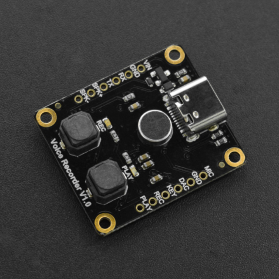

# DFRobot_DF1101S
- [中文版](./README_CN.md)

Wanna buy a simple & practical voice recorder? This one is right for you! The voice recorder module supports 4 controlling modes Arduino, AT command, on-board buttons and ADKEY, and multi-segment voice recording. You can directly press the on-board buttons to record or play voice without using a controller. Moreover, the 16MB storage on the module can store up to 40 minutes recording voice and the recorded files can be copied to your computer via the type-C interface.  




## Product Link (https://www.dfrobot.com/product-2185.html)
    DFR0745: Voice Recorder Module (Breakout)

## Table of Contents

* [Summary](#summary)
* [Installation](#installation)
* [Methods](#methods)
* [Compatibility](#compatibility)
* [History](#history)
* [Credits](#credits)

## Summary
1. Audio Recording <br>
2. Audio Playback


## Installation

To use this library, first download the library file, paste it into the \Arduino\libraries directory, then open the examples folder and run the demo in the folder.

## Methods
```C++
 /**
   * @fn begin
   * @brief init function
   * @param s serial
   * @return Boolean type, Indicates the initialization result
   * @retval true The setting succeeded
   * @retval false Setting failed
   */
  bool begin(Stream &s);
  
  /**
   * @fn setBaudRate
   * @brief Set baud rate(Need to power off and restart, power-down save)
   * @param baud 9600,19200,38400,57600,115200
   * @return Boolean type, the result of seted
   * @retval true The setting succeeded
   * @retval false Setting failed
   */
  bool setBaudRate(uint32_t baud);

  /**
   * @fn setPlayMode
   * @brief Set playback mode 
   * @param mode ePlayMode_t:SINGLECYCLE,ALLCYCLE,SINGLE,RANDOM,FOLDER
   * @return Boolean type, the result of seted
   * @retval true The setting succeeded
   * @retval false Setting failed
   */
  bool setPlayMode(ePlayMode_t mode);

  /**
   * @fn setLED
   * @brief Set indicator LED(Power-down save) 
   * @param on true or false
   * @return Boolean type, the result of seted
   * @retval true The setting succeeded
   * @retval false Setting failed
   */
  bool setLED(bool on);
  
  /**
   * @fn setPrompt
   * @brief Set the prompt tone(Power-down save) 
   * @param on true or false
   * @return Boolean type, the result of seted
   * @retval true The setting succeeded
   * @retval false Setting failed
   */
  bool setPrompt(bool on);
  
  /**
   * @fn setVol
   * @brief Set volume 
   * @param vol 0-30
   * @return Boolean type, the result of seted
   * @retval true The setting succeeded
   * @retval false Setting failed
  */
  bool setVol(uint8_t vol);
  
  /**
   * @fn switchFunction
   * @brief Set working mode 
   * @param function eFunction_t:MUSIC,RECORD,UFDISK
   * @return Boolean type, the result of seted
   * @retval true The setting succeeded
   * @retval false Setting failed
   */
  bool switchFunction(eFunction_t function);
  
  /**
   * @fn next
   * @brief Next 
   * @return Boolean type, the result of operation
   * @retval true The setting succeeded
   * @retval false Setting failed
   */
  bool next();
  
  /**
   * @fn last
   * @brief Previous 
   * @return Boolean type, the result of operation
   * @retval true The setting succeeded
   * @retval false Setting failed
   */
  bool last();
  
  /**
   * @fn start
   * @brief Play 
   * @return Boolean type, the result of operation
   * @retval true The setting succeeded
   * @retval false Setting failed
   */
  bool start();
  
  /**
   * @fn pause
   * @brief Pause 
   * @return Boolean type, the result of operation
   * @retval true The setting succeeded
   * @retval false Setting failed
   */
  bool pause();
  
  /**
   * @fn saveRec
   * @brief Save the recorded voice 
   * @return the name of the recorded audio file
   */
  String saveRec();

  /**
   * @fn delCurFile
   * @brief Delete the currently-playing file 
   * @return Boolean type, the result of operation
   * @retval true The setting succeeded
   * @retval false Setting failed
   */
  bool delCurFile();
  
  /**
   * @fn playSpecFile
   * @brief Play file of the specific path 
   * @param str the name of the audio file to play
   * @return Boolean type, the result of operation
   * @retval true The setting succeeded
   * @retval false Setting failed
   */
  bool playSpecFile(String str);
  
  /**
   * @fn playSpecFile
   * @brief Play the file of specific number, the numbers are arranged according to the sequences the files copied into the U-disk 
   * @param num file number, can be obtained by getCurFileNumber()
   * @return Boolean type, the result of operation
   * @retval true The setting succeeded
   * @retval false Setting failed
   */
  bool playSpecFile(int16_t num);

  /**
   * @fn getVol
   * @brief Get volume 
   * @return vol volume
   */
  uint8_t getVol();

  /**
   * @fn getPlayMode
   * @brief Get palyback mode 
   * @return ePlayMode_t  Play Mode
   */
  ePlayMode_t getPlayMode();
```

## Compatibility

MCU                | Work Well    | Work Wrong   | Untested    | Remarks
------------------ | :----------: | :----------: | :---------: | -----
Arduino Uno        |      √       |              |             | 
Mega2560        |      √       |              |             | 
Leonardo        |      √       |              |             | 
ESP32        |      √       |              |             | 
ESP8266        |      √       |              |             | 
M0        |      √       |              |             | 


## History


- 2020/11/26 - Version 1.0.0 released.

## Credits

Written by fengli(li.feng@dfrobot.com), 2020.11.26 (Welcome to our [website](https://www.dfrobot.com/))


