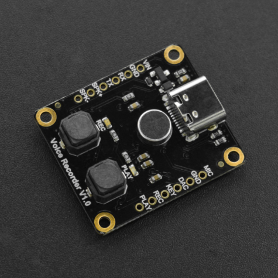

# DFRobot_DF1101S
- [English Version](./README.md)

您是否在寻找一款简单又强大的语音录放模块？看这里！
这款语音录放模块支持arduino、AT指令、板载按键和AD按键四种控制方式。通过板载按键即使在没有微控制器的情况下也能进行录放音。
模块支持多段语音录制，并且模块搭载了16MB的存储空间，可以录制大约40分钟的声音。通过USB线您可以很容易的将模块中的录音拷贝到电脑上。




## 产品链接 (https://www.dfrobot.com.cn/goods-2992.html)
   DFR0745: DF1101S语音录放模块

## 目录

  * [概述](#概述)
  * [库安装](#库安装)
  * [方法](#方法)
  * [兼容性](#兼容性)
  * [历史](#历史)
  * [创作者](#创作者)

## 概述
1.记录语音<br>
2.播放语音

## 库安装

To use this library, first download the library file, paste it into the \Arduino\libraries directory, then open the examples folder and run the demo in the folder.

## 方法
```C++
  bool begin(Stream &s);
  
  /**
   * @fn setBaudRate
   * @brief 设置波特率(需断电重启，掉电保存)
   * @param 9600,19200,38400,57600,115200
   * @return true or false
   */
  bool setBaudRate(uint32_t baud);

  /**
   * @fn setPlayMode
   * @brief 设置播放模式
   * @param ePlayMode_t:SINGLECYCLE,ALLCYCLE,SINGLE
   * @return true or false
   */
  bool setPlayMode(ePlayMode_t mode);

  /**
   * @fn setLED
   * @brief 设置指示灯(掉电保存)
   * @param true or false
   * @return true or false
   */
  bool setLED(bool on);
  
  /**
   * @fn setPrompt
   * @brief 设置提示音(掉电保存)
   * @param true or false
   * @return true or false
   */
  bool setPrompt(bool on);
  
  /**
   * @fn setVol
   * @brief 设置音量
   * @param vol:0-30
   * @return true or false
  */
  bool setVol(uint8_t vol);
  
  /**
   * @fn switchFunction
   * @brief 设置工作模式
   * @param eFunction_t:MUSIC,RECORD,UFDISK
   * @return true or false
   */
  bool switchFunction(eFunction_t function);
  
  /**
   * @fn next
   * @brief 下一曲
   * @return true or false
   */
  bool next();
  
  /**
   * @fn last
   * @brief 上一曲
   * @return true or false
   */
  bool last();
  
  /**
   * @fn start
   * @brief 播放(在音乐模式下) or 录音(在录音模式下)
   * @return true or false
   */
  bool start();
  
  /**
   * @fn pause
   * @brief 暂停播放(在音乐模式下) or 暂停录音(在录音模式下)
   * @return true or false
   */
  bool pause();
  
  /**
   * @fn saveRec
   * @brief 保存录音
   * @return true or false
   */
  String saveRec();
  
  /**
   * @fn delCurFile
   * @brief 删除当前播放文件
   * @return true or false
   */
  bool delCurFile();
  
  /**
   * @fn playSpecFile
   * @brief 播放指定路径文件一次
   * @param 指定路径
   */
  void playSpecFile(String str);
  
  /**
   * @fn playSpecFile
   * @brief 播放指定编号文件一次(仅对默认文件名有效)，如果没有则播放第一个文件
   * @param 文件名编号：0-999
   */
  void playSpecFile(int16_t num);

  /**
   * @fn getVol
   * @brief 获取音量
   * @return vol
   */
  uint8_t getVol();

  /**
   * @fn getPlayMode
   * @brief 获取播放模式
   * @return ePlayMode_t
   */
  ePlayMode_t getPlayMode();
```

## 兼容性

MCU                | Work Well    | Work Wrong   | Untested    | Remarks
------------------ | :----------: | :----------: | :---------: | -----
Arduino Uno        |      √       |              |             | 
Mega2560        |      √       |              |             | 
Leonardo        |      √       |              |             | 
ESP32        |      √       |              |             | 
ESP8266        |      √       |              |             | 
M0        |      √       |              |             | 


## 历史


- 2020/11/26 - Version 1.0.0 released.

## 创作者

Written by fengli(li.feng@dfrobot.com), 2020.11.26 (Welcome to our [website](https://www.dfrobot.com/))


